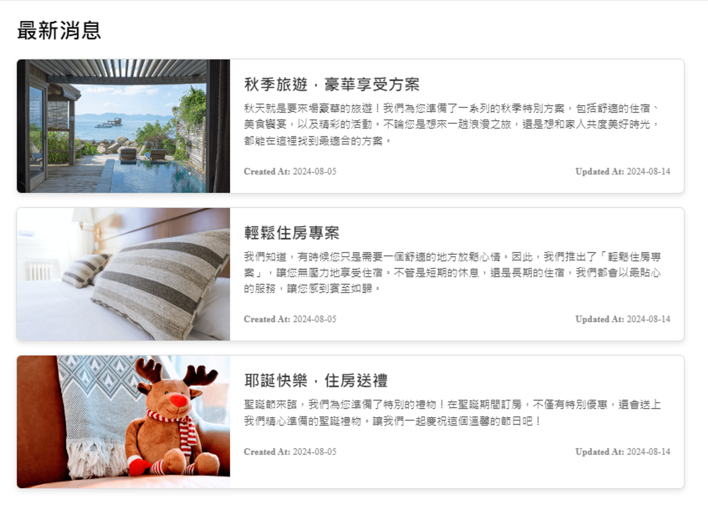

# Day5 - 使用指令建立 Composables 解答



## 安裝

以下將會引導你如何安裝此專案到你的電腦上。

Node.js 版本建議為：`18.0.0` 以上

### 取得專案

```bash
git clone -b day5-composable  https://github.com/jasonlu0525/nuxt3-live-answer.git
```

### 移動到專案內

```bash
cd nuxt3-live-answer
```

### 安裝套件

```bash
npm install
```

### 運行專案

```bash
npm run dev
```

### 開啟專案

在瀏覽器網址列輸入以下即可看到畫面

```bash
http://localhost:3000/
```